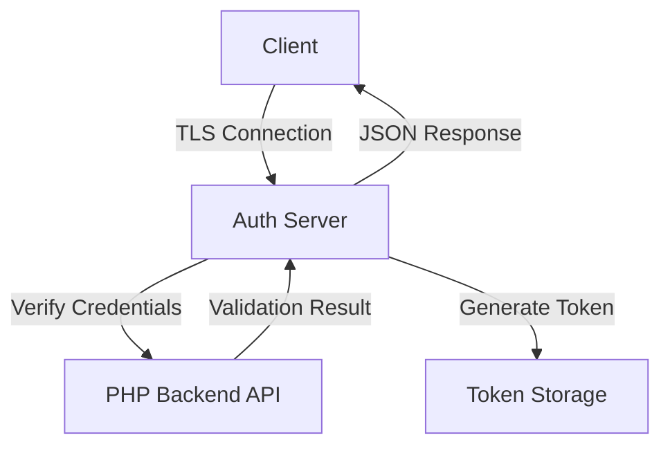

# 🔐 Authentication Server

**Secure TLS Authentication Microservice with Hardware ID Validation**

A high-performance, secure authentication server built in C that provides TLS-encrypted client authentication with hardware ID validation and token generation capabilities.

## ✨ Features

- **🔒 TLS 1.2 Encryption** - Secure communication using WolfSSL
- **🖥️ Hardware ID Validation** - CPU-based device fingerprinting
- **⚡ High Performance** - Lightweight and efficient C implementation
- **🔑 Token Generation** - Secure MD5-based token issuance
- **🌐 RESTful API** - JSON responses for easy integration
- **🛡️ Security First** - Built with security best practices
- **📊 Logging** - Comprehensive connection and authentication logging

## 🏗️ Architecture

# SSL Client - Secure Authentication System

A modern, secure client application with SSL encryption, hardware-based authentication, and a beautiful blurred UI interface.

## ✨ Features

- **🔒 Secure SSL/TLS Connection** - Encrypted communication with wolfSSL
- **🖥️ Modern UI** - Beautiful ImGui interface with acrylic blur effect
- **🔐 Hardware Authentication** - HWID and CPUID-based security
- **⏰ Time-based Tokens** - Protection against replay attacks
- **🎨 DirectX 11 Rendering** - Smooth and responsive graphics
- **🌐 JSON Protocol** - Modern REST-like communication

## 📦 Requirements

### Build Dependencies
- Visual Studio 2019 or 2022
- C++17 compatible compiler
- Windows 10/11 SDK

### Third-party Libraries
- [wolfSSL](https://www.wolfssl.com/) - SSL/TLS library
- [Dear ImGui](https://github.com/ocornut/imgui) - Immediate mode GUI
- [nlohmann/json](https://github.com/nlohmann/json) - JSON parsing
- DirectX 11 - Graphics API
